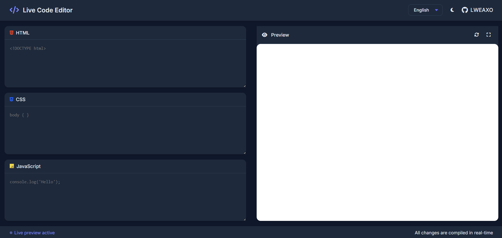

# 🌟 LWEAXO Canlı Kod Editörü

**🚀 Gerçek Zamanlı Web Geliştirme Ortamı**



## ✨ Temel Özellikler

- **⚡ Anlık Önizleme** - Yazarken değişiklikleri anında görün
- **🎨 Akıllı Arayüz**
  - Sürüklenebilir/yeniden boyutlandırılabilir paneller
  - Tema değiştirme (koyu/aydınlık)
  - Söz dizimi vurgulama
- **🌐 Çoklu Dil Desteği** - 6+ arayüz dili

```html
<!-- Örnek Kod -->
<div class="harika-efekt">
  <h1>Merhaba Dünya!</h1>
</div>
```

## 🛠️ Kurulum

1. Depoyu klonlayın:
```bash
git clone https://github.com/LWEAXO/canli-kod-editörü.git
```
2. `index.html` dosyasını tarayıcıda açın

## 🎨 Tema Önizlemeleri

| Koyu Tema | Aydınlık Tema |
|-----------|--------------|
|  |  |

## 🚀 Hızlı Başlangıç

[]()


## 🤝 Katkıda Bulunma

1. Projeyi çatallayın (fork)
2. Yeni dal oluşturun (`git checkout -b özellik/HarikaÖzellik`)
3. Değişiklikleri kaydedin (`git commit -m 'Harika özellik ekle'`)
4. Gönderin (`git push origin özellik/HarikaÖzellik`)
5. Pull Request açın

## 📜 Lisans

MIT © [LWEAXO](https://github.com/LWEAXO)

---